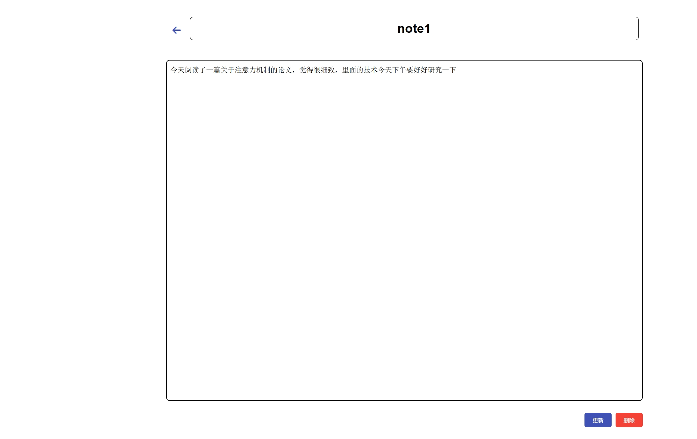

# ⏳ 时砾 - 时间管理与任务协作系统

**时砾（TimeGrit）**，寓意时间如沙砾，珍惜每一粒。  
这是一个基于 Flask 构建的轻量级任务管理系统，支持任务安排、笔记记录、评论互动等功能，适用于日常学习计划管理与记录。

---

## ⚡️ 快速体验

- 🔗 访问：[时砾任务官网](http://power-sci.com.cn)

---

## 🚀 项目亮点

- ✅ **任务清单管理**（增删改查）
- 📝 **个人笔记模块**（文本编辑）
- 💬 **评论模块**（任务和笔记的交流与反馈）
- 🌐 **前后端分离架构**，支持跨域访问
- 🔒 **安全性考虑**：JWT Token 验证、输入校验、错误处理、数据库防注入
- 📅 **日期时间安排**：任务计划具体到日期、时间，方便精细化管理

---

## 🛠️ 技术栈选择

### 🧩 后端技术

- **框架**：Flask — 轻量级 Python Web 框架，适合快速开发
- **语言**：Python
- **数据库**：MySQL — 结构清晰，便于维护
- **认证**：JWT Token — 安全的用户身份验证方式

### 🎨 前端技术

- **框架**：原生 HTML/CSS/JavaScript — 简洁灵活，轻量高效

---

## 📁 项目结构
```
时砾APP/
│
├── frontend/ # 前端页面
│ ├── images/ # 图片资源
│ ├── comment.html # 评论页面
│ ├── forget.html # 忘记密码页面
│ └── ...
│
├── routes/ # 后端路由模块
├── app.py # Flask 应用启动入口
├── config.py # 配置文件（数据库等）
├── db.py # 数据库连接封装
├── requirements.txt # 项目依赖清单
```

---

## 📋 功能说明

### 1️⃣ 任务管理

- 添加任务：设置名称、描述、截止日期、状态
- 查看任务：任务列表一目了然
- 编辑任务：随时调整任务内容
- 删除任务：移除已完成或不再需要的任务

<p align="center">
  
  
</p>

---

### 2️⃣ 笔记功能

- 创建笔记：记录灵感或要点

<p align="center">
  
  
</p>

---

### 3️⃣ 评论系统

- 所有用户可在论坛区评论并删除


<p align="center">
  
</p>

---

## 💡 提示说明

### 🧭 前端配置提示  

在 `frontend` 文件夹中的 HTML 文件（如 `task.html`, `note.html` 等）中，所有涉及后端 API 调用的部分，已将原始服务器 IP 地址统一替换为占位符 `my_ip`。  

> 🔧 **请根据你的部署环境**，将 `my_ip` 替换为实际服务器的 IP 地址或域名，例如：
> - `http://127.0.0.1:5000`（本地测试）
> - `http://your-domain.com`（线上部署）

---

### 🛠 后端配置提示  

在 `config.py` 配置文件中，以下数据库连接参数为通用占位符，部署前请务必修改：

- 📌 数据库密码：`mysql_password`  
- 📌 数据库名称：`my_database`  

> 🔐 **修改建议**：请根据你的本地或远程 MySQL 配置，替换上述字段，以确保后端可以正常连接数据库。

---

### ✅ 建议操作  

- ♻️ 修改完配置后，请**重启 Flask 服务**以使更改生效；
- 🛡️ 如果部署在公网，**请勿将真实密码写入配置文件**，建议使用 `.env` 环境变量或配置文件分离策略来提高安全性。

---

## 🧾 开源协议

本项目基于 [MIT License](LICENSE) 开源发布，欢迎学习、使用与二次开发。
